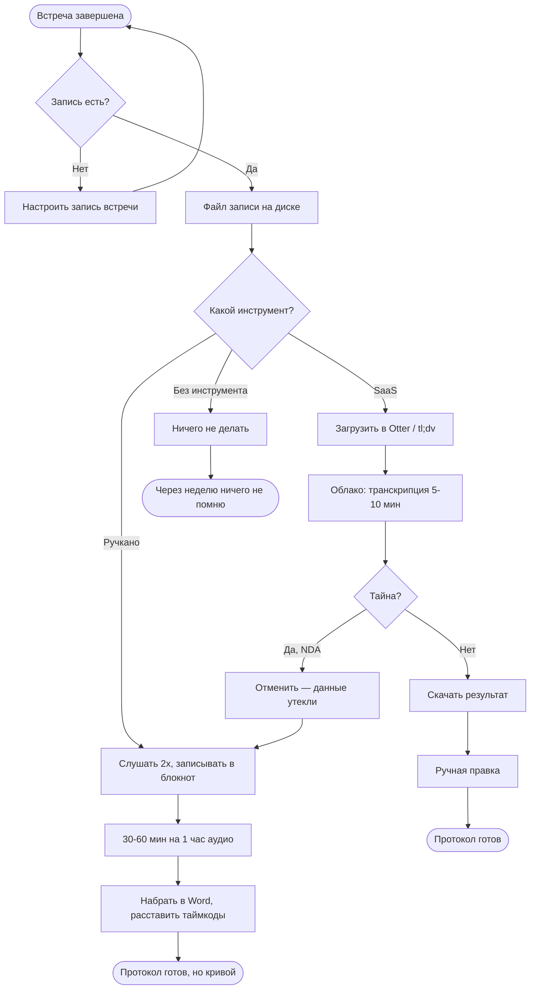
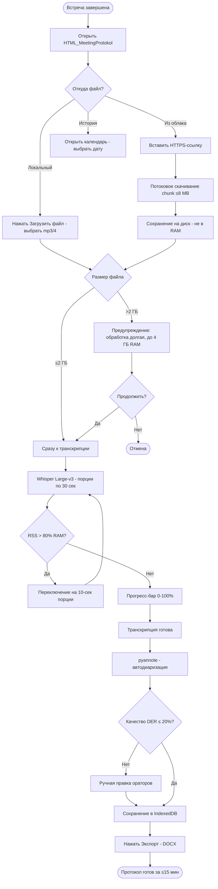
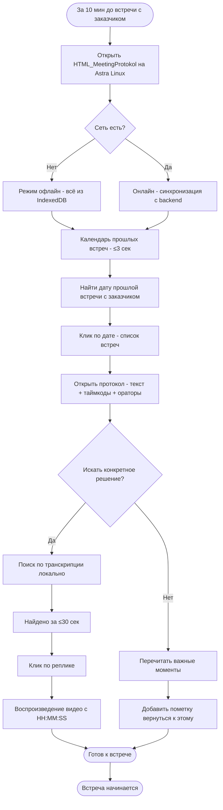
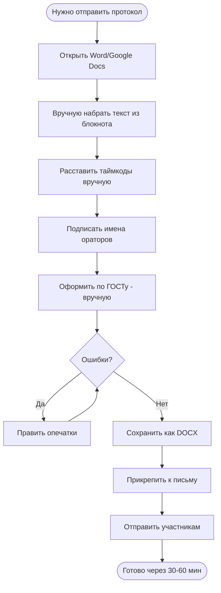
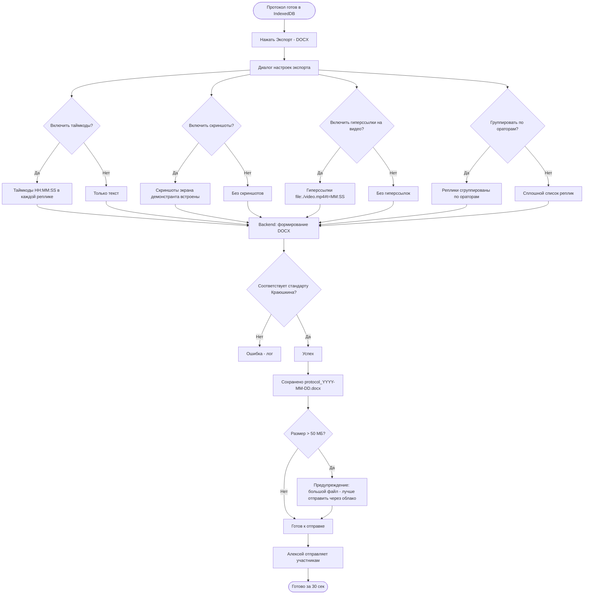
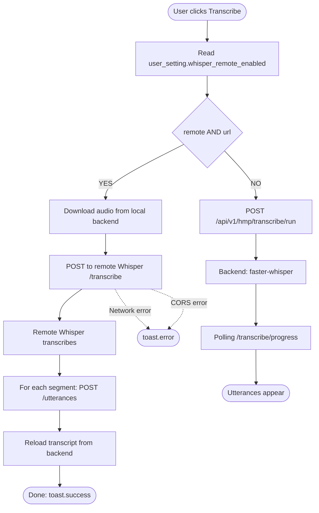

# Бизнес-процессы: HTML_MeetingProtokol

## 1. Метаинформация

| Поле | Значение |
|---|---|
| **Проект** | HTML_MeetingProtokol |
| **Дата** | 2026-09-14 |
| **Источники** | vision/VISION.md, personas/PERSONAS.md, user-stories/US_LIST.md |
| **Нотация** | Mermaid (flowchart) |
| **Процессов описано** | 4 |
| **Автор** | Алексей |

---

## 2. Реестр процессов

| # | Процесс | Цель | Триггер | Результат | Приоритет | As-Is → To-Be |
|---|---|---|---|---|---|---|
| P-01 | Подготовка протокола встречи | Превратить аудио/видео запись в структурированный протокол с репликами и ораторами | Завершение встречи, появление записи | DOCX-файл с таймкодами, ораторами, репликами | Must | да |
| P-02 | Онлайн-встреча в Яндекс Телемост с ведением протокола в реальном времени | Вести протокол во время встречи, не отвлекаясь от разговора | Старт встречи в Телемост | Протокол с таймкодами + скриншоты + action items сразу после встречи | Must | да |
| P-03 | Подготовка к встрече в командировке (Astra Linux, офлайн) | Быстро найти протокол прошлой встречи и вспомнить детали без интернета | За 10–15 мин до новой встречи | Открытый протокол, найденные реплики, воспроизведённое видео | Must | да |
| P-04 | Экспорт протокола в DOCX | Сформировать готовый к отправке документ по стандарту Краюшкина | Нажатие «Экспорт → DOCX» | DOCX-файл с таймкодами, гиперссылками на видео, опционально скриншотами | Must | да |

---

## 3. Словарь терминов

| Термин | Определение |
|---|---|
| **Протокол** | Структурированный документ по итогам встречи: реплики с таймкодами, имена ораторов, повестка, решения, action items |
| **Транскрипция** | Автоматическое распознавание речи из аудио/видео в текст с таймкодами (через Whisper / Vosk) |
| **Диаризация** | Автоматическое определение ораторов по голосовому профилю (через pyannote) |
| **Таймкод** | Метка времени в формате HH:MM:SS, привязанная к реплике и к моменту видео |
| **Action items** | Список задач, вытекающих из встречи (кто / что / когда) |
| **Саммари** | Краткое резюме встречи, сгенерированное локальной LLM (Ollama / llama.cpp) |
| **OCR-скриншот** | Снимок экрана демонстранта в момент реплики (через `getDisplayMedia` или захват iframe) |
| **Live Mode** | Режим приложения с тремя панелями (видео / темы / живая транскрипция) |
| **Voice profile** | Голосовой «отпечаток» оратора, сохранённый после первой разметки — для авто-идентификации в будущем |
| **Календарь прошлых встреч** | Визуальная навигация по истории протоколов (месяц / неделя / день) |
| **OOM (Out Of Memory)** | Аварийное завершение процесса из-за нехватки RAM. Критичный риск, митигируется лимитами (см. Vision §9) |
| **IndexedDB** | Локальное хранилище браузера (используется для офлайн-режима в Astra) |
| **Whisper** | Локальная модель транскрипции от OpenAI (Large-v3 = ~3 ГБ) |
| **pyannote** | Локальная модель диаризации (Speaker Diarization Pipeline) |
| **Краюшкин (стандарт)** | Стандарт оформления DOCX: TNR 12, поля 20/10/10/10, заголовки 1/2/3, таблицы «Сетка таблицы» |
| **RACI** | Матрица ответственности: Responsible / Accountable / Consulted / Informed |
| **Roadmap** | График релизов: MVP (Q4 2026) → Q1 2027 → Q2 2027 |

---

## 4. Процесс P-01: Подготовка протокола встречи

### 4.1. As-Is (текущее состояние — без приложения)

**Участники:**
- Алексей (P-01) — инициатор, исполнитель
- SaaS-сервис (Otter / Fireflies / tl;dv) — внешний облачный сервис (опционально)

**Триггер:** Завершение встречи, появление аудио/видеозаписи на диске

**Цель:** Получить структурированный протокол встречи



**Проблемы as-is:**
- ❌ Ручной режим: 30–60 мин на 1 час аудио, теряются реплики, нет таймкодов
- ❌ SaaS: данные уходят в чужие облака, риск нарушения NDA и 152-ФЗ
- ❌ Без инструмента: через неделю не помню 80% решений

### 4.2. To-Be (целевое состояние с HTML_MeetingProtokol)

**Участники:**
- Алексей (P-01) — инициатор, исполнитель, контролёр
- Backend (FastAPI + Whisper + pyannote) — автоматизация
- IndexedDB + файловая система — локальное хранилище

**Триггер:** Завершение встречи, появление аудио/видеозаписи на диске

**Цель:** Получить готовый DOCX с минимальными затратами времени



**Что улучшается:**
- ✅ Время: с 30–60 мин → ≤15 мин (в 2–4 раза быстрее)
- ✅ Приватность: всё локально, 0 байт уходит в облако
- ✅ Найдены все реплики, есть таймкоды
- ✅ Автодиаризация с DER ≤ 20%
- ✅ Защита от OOM (chunk ≤8 MB, мониторинг RSS)

### 4.3. RACI для P-01

| Действие | Алексей (P-01) | Backend | Whisper/pyannote |
|---|---|---|---|
| Загрузка файла | R, A | C | I |
| Скачивание по ссылке | R, A | R | — |
| Транскрипция | I | R | R |
| Мониторинг ресурсов | I | R | I |
| Диаризация | I | R | R |
| Ручная правка ораторов | R, A | C | — |
| Экспорт DOCX | R, A | R | — |
| Отправка участникам | R, A | I | — |

**Условные обозначения:** R — Responsible (делает), A — Accountable (отвечает за результат), I — Informed (уведомлён).

---

## 5. Процесс P-02: Онлайн-встреча в Яндекс Телемост

### 5.1. As-Is (текущее состояние — без приложения)

**Участники:**
- Алексей (P-01) — участник встречи
- Участники встречи (P-03 гости)
- Яндекс Телемост — платформа видеосвязи

**Триггер:** Старт встречи в Яндекс Телемост

**Проблема:** Алексей одновременно участвует в разговоре и пытается конспектировать → теряет нить, успевает записать только 20% решений.

### 5.2. To-Be (целевое состояние)

```mermaid
flowchart LR
    Start([Старт встречи в Телемост]) --> Open[Открыть HTML_MeetingProtokol]
    Open --> PasteURL[Вставить ссылку на Телемост]
    PasteURL --> Embed[Загрузить iframe Телемоста в Левую панель]

    Embed --> Live[Правая панель: живая транскрипция]
    Live --> Whisper[Whisper streaming latency ≤3 сек]
    Whisper --> Topics[Центральная панель: авто-темы]
    Topics --> Capture[Захват скриншотов экрана демонстранта]

    Capture --> MeetingContinues[Встреча продолжается...]
    MeetingContinues --> UserAction{Алексей помечает важное?}
    UserAction -->|Да| Mark[Клик по реплике - важное]
    Mark --> MeetingContinues
    UserAction -->|Нет| MeetingContinues

    MeetingContinues --> End([Встреча завершена])
    End --> AutoSave[Автосохранение протокола в IndexedDB]
    AutoSave --> Screenshots[Скриншоты привязаны к моментам]
    Screenshots --> Export[Экспорт DOCX со скриншотами + гиперссылками]
    Export --> Send[Отправить участникам]
    Send --> Done([Готово за ≤1 мин после встречи])
```



**Что улучшается:**
- ✅ Алексей участвует в разговоре, а не конспектирует
- ✅ Все реплики распознаны с таймкодами (латентность ≤3 сек)
- ✅ Скриншоты экрана демонстранта захвачены автоматически
- ✅ Помеченные реплики выделены в итоговом DOCX
- ✅ Готовый DOCX через 1 минуту после встречи

### 5.3. RACI для P-02

| Действие | Алексей (P-01) | Backend WS | Whisper streaming | Телемост |
|---|---|---|---|---|
| Подключение к встрече | R, A | — | — | R |
| Загрузка iframe | R | — | — | C |
| Живая транскрипция | I | R | R | — |
| Авто-выделение тем | I | R | — | — |
| Захват скриншотов | I | R | — | — |
| Пометка важных реплик | R, A | — | — | — |
| Экспорт DOCX после встречи | R, A | R | — | — |

---

## 6. Процесс P-03: Подготовка к встрече в командировке (Astra Linux, офлайн)

### 6.1. As-Is (текущее состояние — без приложения)

**Участники:**
- Алексей (P-02) — тот же человек, в защищённом периметре без сети

**Триггер:** За 10–15 мин до встречи с заказчиком

**Проблема:** Без интернета нельзя открыть блокнот, спросить коллегу в Telegram, загуглить. Если протокол не лежит локально — приходится полагаться на память → выглядит непрофессионально.

### 6.2. To-Be (целевое состояние)



**Что улучшается:**
- ✅ Календарь открывается за ≤3 сек (даже без сети)
- ✅ Поиск по транскрипции работает локально
- ✅ Видео воспроизводится с таймкода (без обращения к серверу)
- ✅ Можно добавлять пометки для будущего использования
- ✅ Никакой зависимости от облака

### 6.3. RACI для P-03

| Действие | Алексей (P-02) | Backend (локальный) | IndexedDB |
|---|---|---|---|
| Запуск приложения | R, A | — | I |
| Открытие календаря | R | R | R |
| Поиск по транскрипции | R | — | R |
| Воспроизведение видео | R | I | R |
| Добавление пометки | R, A | — | R |

---

## 7. Процесс P-04: Экспорт протокола в DOCX

### 7.1. As-Is (текущее состояние — без приложения)

**Участники:**
- Алексей (P-01) — инициатор, исполнитель
- Microsoft Word / Google Docs — инструмент редактирования
- Outlook / Telegram — канал отправки

**Триггер:** Необходимо отправить участникам встречи итоговый документ



**Проблемы as-is:**
- ❌ Время: 30–60 мин на протокол
- ❌ Ошибки в таймкодах
- ❌ Пропущенные реплики
- ❌ Оформление не соответствует стандарту Краюшкина (нет правильных полей, заголовков)
- ❌ Нет гиперссылок на видео

### 7.2. To-Be (целевое состояние)



**Что улучшается:**
- ✅ Время: с 30–60 мин → 30 сек (в 60–120 раз быстрее)
- ✅ Таймкоды автоматические, без ошибок
- ✅ Все реплики сохранены
- ✅ Оформление 100% по стандарту Краюшкина (TNR 12, поля 20/10/10/10, заголовки 1/2/3, таблицы «Сетка таблицы», нумерация страниц)
- ✅ Гиперссылки на видео работают в Word/LibreOffice

### 7.3. RACI для P-04

| Действие | Алексей (P-01) | Backend (python-docx) | Участник (P-03) |
|---|---|---|---|
| Настройка параметров экспорта | R, A | I | — |
| Формирование DOCX | I | R | — |
| Проверка XML-валидности | I | R | — |
| Применение стандарта Краюшкина | I | R | — |
| Отправка участникам | R, A | — | I |
| Получение и просмотр DOCX | I | — | R |

---

## 8. Сравнение as-is vs to-be (сводная таблица)

| Аспект | As-Is | To-Be | Выигрыш |
|---|---|---|---|
| **Время на подготовку протокола (1 час встречи)** | 30–60 мин | ≤15 мин | в 2–4 раза быстрее |
| **Время на экспорт DOCX** | 30–60 мин | 30 сек | в 60–120 раз быстрее |
| **Приватность данных** | SaaS — утечка в облако | 100% локально | устранение риска NDA/152-ФЗ |
| **Точность таймкодов** | руками, ±10 сек | автоматически, ±1 сек | в 10 раз точнее |
| **Покрытие реплик** | 60–80% (пропуски) | ≥95% (WER ≤15%) | +20–35% |
| **Поиск по протоколам** | Ctrl+F в одном файле | семантический поиск по всей базе | качественно новый уровень |
| **Офлайн-доступ (Astra Linux)** | невозможно | календарь + поиск + видео | полный доступ |
| **Визуальная навигация** | список из 50+ протоколов | календарь с цветными точками | в 10 раз быстрее поиск |
| **Онлайн-ведение протокола** | невозможно (отвлекает) | три панели без конспектирования | новая функциональность |
| **Риск OOM** | не контролируется | лимиты + мониторинг + автопауза | количественно безопасно |

---

## 9. Глоссарий процессов

| Термин | Контекст |
|---|---|
| **Дорожка (Lane)** | В BPMN — горизонтальная/вертикальная полоса, отвечающая за роль (Алексей / Backend / Whisper). В Mermaid реализуется через `subgraph` |
| **Пул (Pool)** | В BPMN — контейнер для одного процесса или организации. В Mermaid — корень диаграммы |
| **Эксклюзивный шлюз (Exclusive Gateway)** | Ромб — ветвление по условию (да/нет). В Mermaid — `{Вопрос?}` |
| **Параллельный шлюз (Parallel Gateway)** | Квадрат со знаком + — разделение потока на несколько. В наших процессах не используется (все ветвления последовательные) |
| **Sequence Flow** | Поток управления между элементами. В Mermaid — `-->` |
| **Message Flow** | Поток сообщений между пулами. В нашем случае: Алексей ↔ Backend ↔ Whisper (внутренние потоки) |
| **Start Event** | Круг — начало процесса. В Mermaid — `([Старт])` |
| **End Event** | Круг с жирной рамкой — завершение. В Mermaid — `([Конец])` |
| **User Task** | Прямоугольник — действие пользователя. В Mermaid — `[Действие]` |
| **Service Task** | Прямоугольник с шестерёнкой — автоматическое действие системы. В Mermaid — `[\`\`\`Действие\`\`\`] ` (моноширинный шрифт) |

---

## 10. Связь с pipeline

- **Предыдущий шаг:** `user-story-generator` (`artifacts/03-user-stories/`) ✅
- **Следующий шаг:** `form-spec-builder` (`artifacts/05-forms/`) — формы для каждого процесса
- **Связь с US:**
  - P-01 → US-001..009 (загрузка, транскрипция, диаризация, правка)
  - P-02 → US-018..021 (Телемост, Live Mode)
  - P-03 → US-011, 012, 013, 014, 026, 027, 028 (Astra Linux, офлайн)
  - P-04 → US-015, 016, 017 (DOCX-экспорт)
- **Связь с Vision:** §7 Scope (все процессы описаны), §8 Risks (митигации), §9 Ограничения (контроль ресурсов)

## Поддерживаемые форматы (E173)

```
Пользователь выбирает файл
    ↓
Проверка расширения (frontend ALLOWED_EXTENSIONS):
  ✅ Аудио: mp3, wav, m4a, ogg, flac, opus, webm, aac, mka
  ✅ Видео: mp4, mkv, webm, mov, avi, 3gp, ogv
    ↓
POST /protocols с file → streaming save
    ↓
Backend НЕ валидирует MIME (доверяет faster-whisper)
    ↓
Whisper.transcribe(audio_path) → ffmpeg decode → распознавание
```

## Process: Транскрибация через Remote Whisper (US-089)

**Триггер:** Пользователь нажимает "Транскрибировать" на странице протокола

**Шаги:**

1. Frontend читает `user_setting.whisper_remote_enabled`
2. **Decision (switch/if):**
   - **IF `enabled=true` AND `url` валидный** → Remote flow (шаг 3)
   - **ELSE** → Local flow (шаг 8)

3. **Remote flow:**
   - Frontend скачивает аудио с локального backend: `GET /media/protocols/{id}/source.{ext}`
   - Frontend формирует FormData: {file, model, language, beam_size}
   - Frontend POST `{remote_url}{remote_path}` через XHR с прогрессом загрузки
   - Remote сервер: faster-whisper → JSON `{text, language, duration_sec, segments[]}`
   - Frontend: показывает прогресс-бар 0% → 100%
4. **Save result locally:**
   - Для каждого segment в ответе: `POST /api/v1/hmp/utterances` (или PATCH) 
   - Frontend обновляет `window._currentUtterances` и перерисовывает transcript
5. **Done:** toast.success "Удалённый Whisper вернул N реплик"

6. **Failure handling:**
   - Network error → toast.error + UI обновляется
   - Поля «Источник» сбрасывать не нужно — пользователь сам решит
7. Пользователь в любой момент может переключиться на "Локальный"

8. **Local flow (default):**
   - Frontend: `POST /api/v1/hmp/transcribe/run` с `model=large-v3`
   - Backend: запускает faster-whisper + сохраняет utterances в БД
   - Polling `GET /transcribe/progress/{task_id}` каждые 2 сек
   - Utterances появляются по мере обработки (streaming)

**Mermaid диаграмма:**



**Acceptance:** см. US-089.md
