# Screen Flow: HTML_MeetingProtokol

## 1. Метаинформация

| Поле | Значение |
|---|---|
| **Проект** | HTML_MeetingProtokol |
| **Дата** | 2026-09-14 |
| **Источники** | artifacts/03-user-stories/1_us_list/US_LIST.md, artifacts/05-forms/, artifacts/04-processes/PROCESSES.md |
| **Персон** | 3 (P-01, P-02, P-03) |
| **Экранов** | 16 |
| **Сценариев** | 8 |
| **State-диаграмм** | 4 |
| **Автор** | Алексей |

---

## 2. Карта экранов

| ID | Экран | Форма / Тип | Платформа | Роли | Описание |
|---|---|---|---|---|---|
| S-001 | Home | Главная страница | Windows, Astra | P-01, P-02 | Навигация: список протоколов, календарь, Live Mode |
| S-002 | ProtocolList | FORM_PROTOCOL_LIST (нет спецификации — список) | Windows, Astra | P-01, P-02 | Хронологический список всех протоколов |
| S-003 | UploadForm | FORM_UPLOAD (F-HMP-1) | Windows | P-01 | Загрузка локального файла или по HTTPS-ссылке |
| S-004 | ProtocolView | FORM_PROTOCOL_VIEW (F-HMP-2) | Windows, Astra | P-01, P-02, P-03 | Просмотр протокола: видео, реплики, метаданные |
| S-005 | CalendarView | FORM_CALENDAR_VIEW (F-HMP-3) | Windows, Astra | P-01, P-02 | Календарь прошлых встреч (день/неделя/месяц) |
| S-006 | TranscriptView | FORM_TRANSCRIPT_VIEW (F-HMP-4) | Windows, Astra | P-01, P-02 | Список реплик с таймкодами, фильтры, поиск |
| S-007 | SpeakerEditor | Модальное окно | Windows | P-01 | Ручная корректировка меток ораторов |
| S-008 | TranscriptEditor | Модальное окно | Windows | P-01 | Ручная правка текста реплик |
| S-009 | ExportDialog | FORM_EXPORT_DIALOG (F-HMP-5) | Windows | P-01 | Настройка и запуск экспорта DOCX |
| S-010 | LiveMode | FORM_LIVE_MODE (F-HMP-6) | Windows | P-01 | Три панели: видео + темы + живая транскрипция |
| S-011 | SummaryButton | Модальное окно | Windows | P-01 | Саммари встречи через локальную LLM |
| S-012 | ActionItems | Модальное окно | Windows | P-01 | Список action items, сгенерированных AI |
| S-013 | TagEditor | Модальное окно | Windows | P-01 | Ручное тегирование протокола |
| S-014 | SearchBar | Глобальный компонент | Windows, Astra | P-01, P-02 | Поиск по всем протоколам |
| S-015 | OfflineIndicator | Глобальный компонент | Astra | P-02 | Индикатор офлайн-режима |
| S-016 | PrivacyBadge | Компонент в шапке | Windows | P-01, P-03 | Индикатор «Данные хранятся локально» |

**Всего экранов:** 16

### Распределение по типам

| Тип | Количество |
|---|---|
| Главная страница | 1 (S-001) |
| Формы (содержательные экраны) | 6 (S-003, S-004, S-005, S-006, S-009, S-010) |
| Модальные окна | 5 (S-007, S-008, S-011, S-012, S-013) |
| Глобальные компоненты | 3 (S-014, S-015, S-016) |
| Списки | 1 (S-002) |

---

## 3. UI-flow (основной граф навигации)

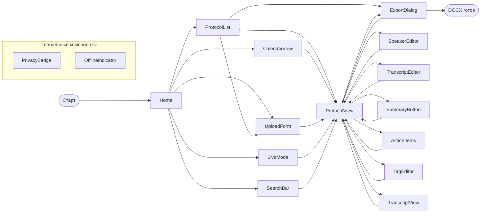

**Описание UI-flow:**
- **S-001 Home** — точка входа для всех сценариев.
- **S-002 ProtocolList, S-005 CalendarView** — две независимые навигации к протоколу (список или календарь).
- **S-003 UploadForm** — единственный путь для создания нового протокола.
- **S-010 LiveMode** — отдельный режим для онлайн-встреч; после завершения редирект на S-004 ProtocolView.
- **S-004 ProtocolView** — главный «хаб» для всех операций над протоколом (просмотр, экспорт, правка, AI).
- **S-007..S-013** — модальные окна для действий над протоколом; всегда возвращаются в S-004.
- **S-009 ExportDialog** — единственный путь к результату «DOCX готов».

---

## 4. Sequence-диаграммы по сценариям

### 4.1. SC-01: Загрузка локального файла (US-001)

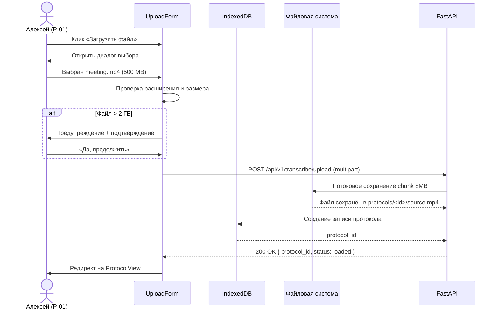

### 4.2. SC-02: Загрузка по HTTPS-ссылке (US-002)

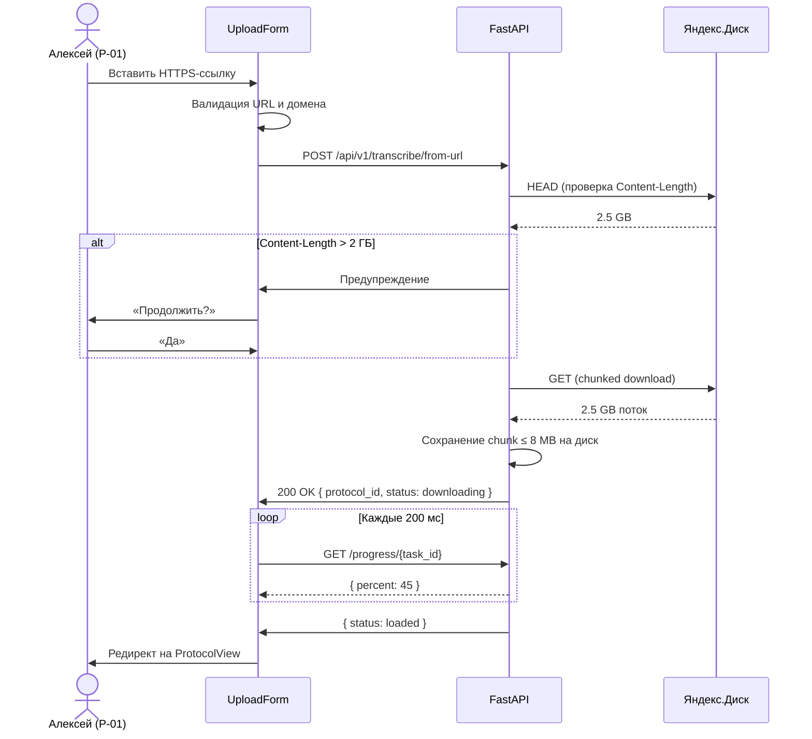

### 4.3. SC-03: Транскрипция и диаризация (US-005, US-007)

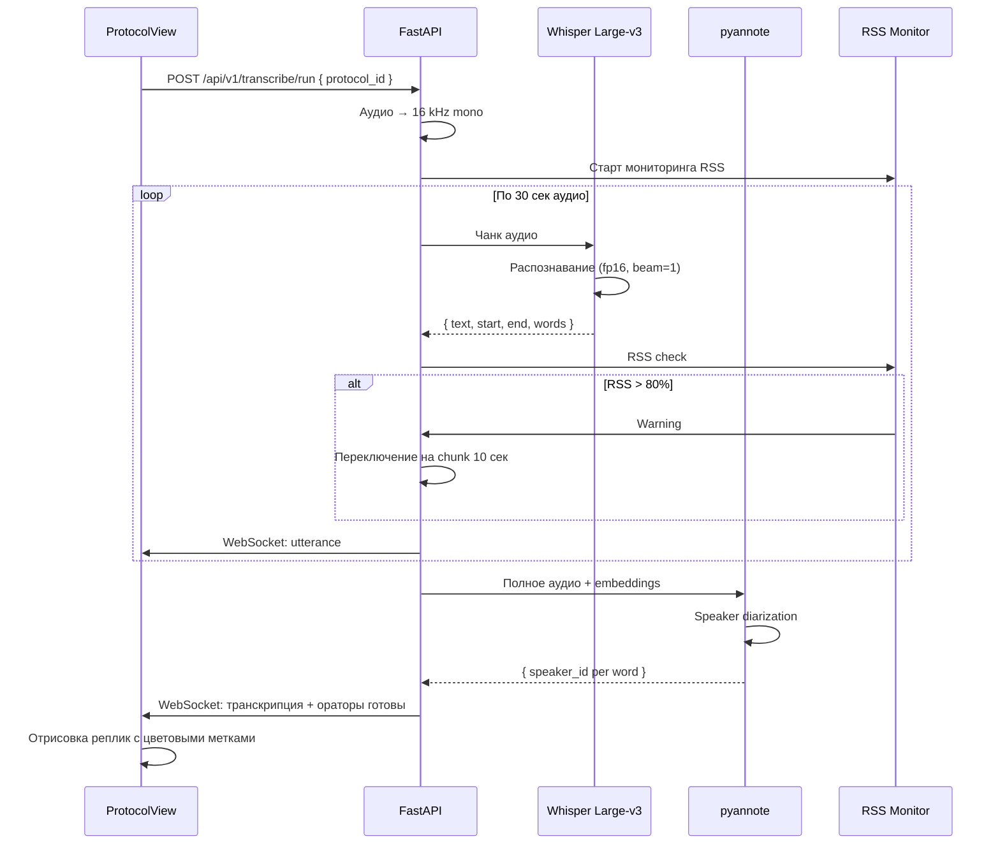

### 4.4. SC-04: Просмотр протокола в Astra Linux офлайн (US-027)

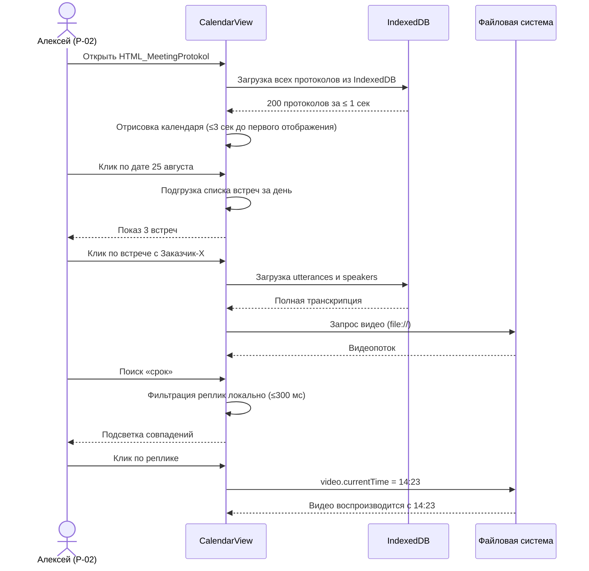

### 4.5. SC-05: Live Mode (Яндекс Телемост) (US-019, US-020)

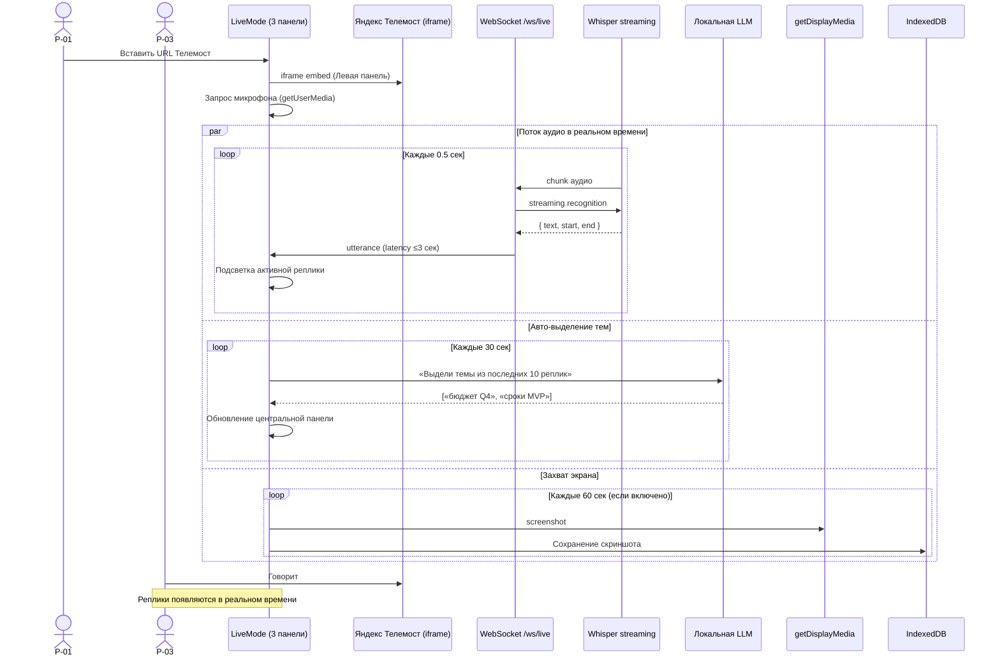

### 4.6. SC-06: Ручная правка ораторов (US-008)

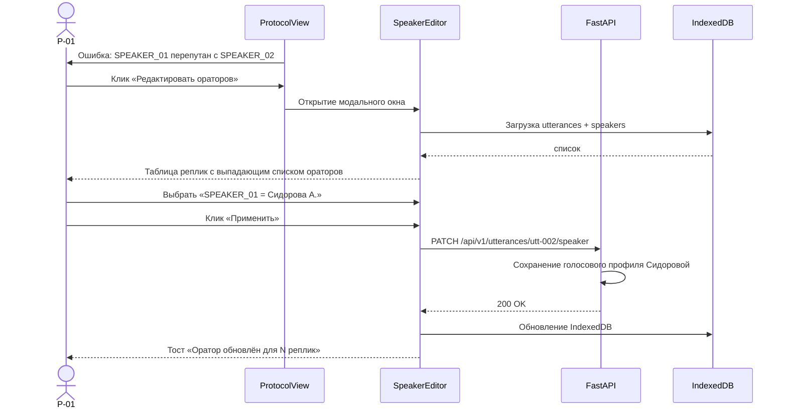

### 4.7. SC-07: Экспорт DOCX со скриншотами (US-015, US-016, US-017)

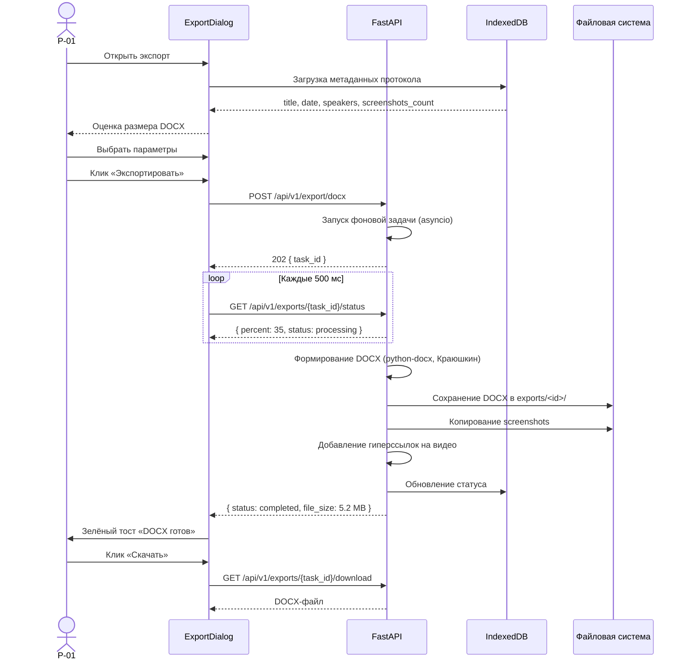

### 4.8. SC-08: AI-саммари + action items (US-022, US-023)

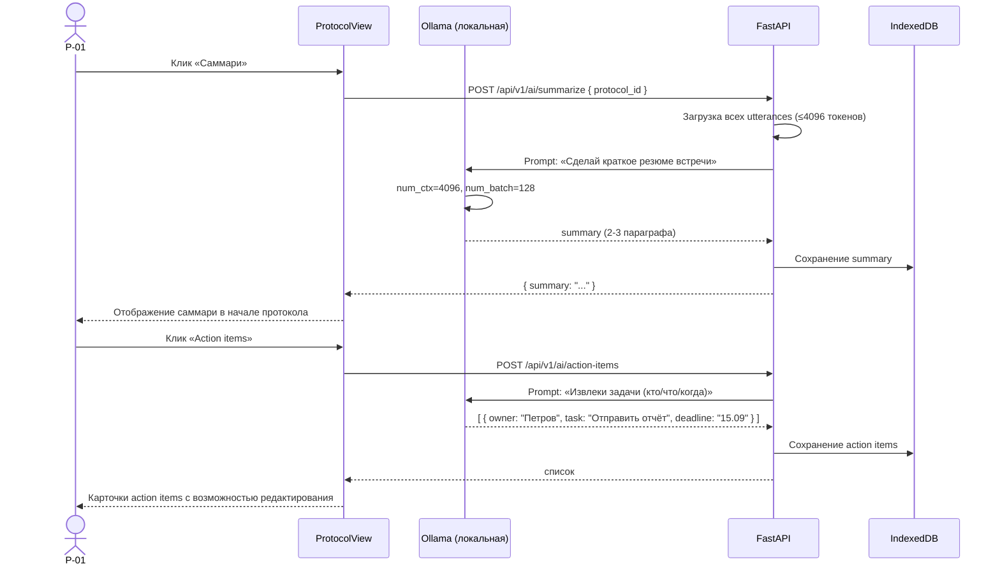

---

## 5. Auth-flow / Онбординг

В MVP приложения нет регистрации и логина (это single-user приложение). Однако есть **онбординг при первом запуске**:

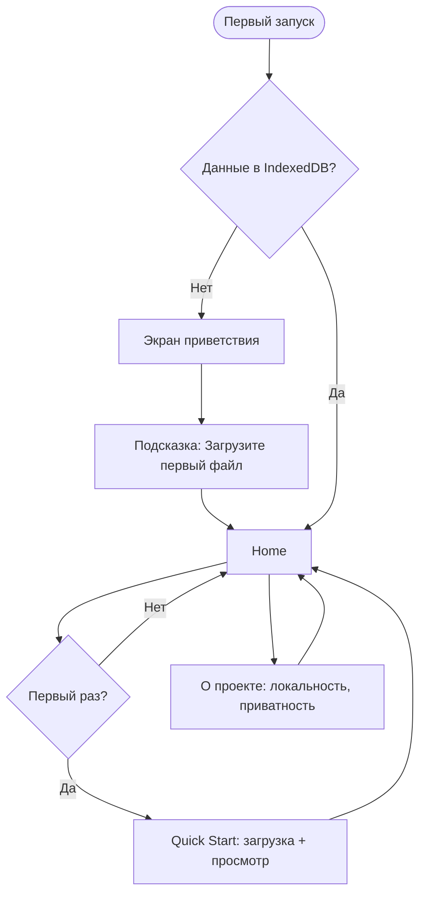

**Особенности:**
- Нет регистрации/логина — single-user приложение.
- При первом запуске — экран приветствия с объяснением «всё локально, никаких облаков».
- Кнопка «О проекте» — на главной, объясняет приватность (важно для P-03).

---

## 6. State-диаграммы

### 6.1. ST-01: Транскрипция

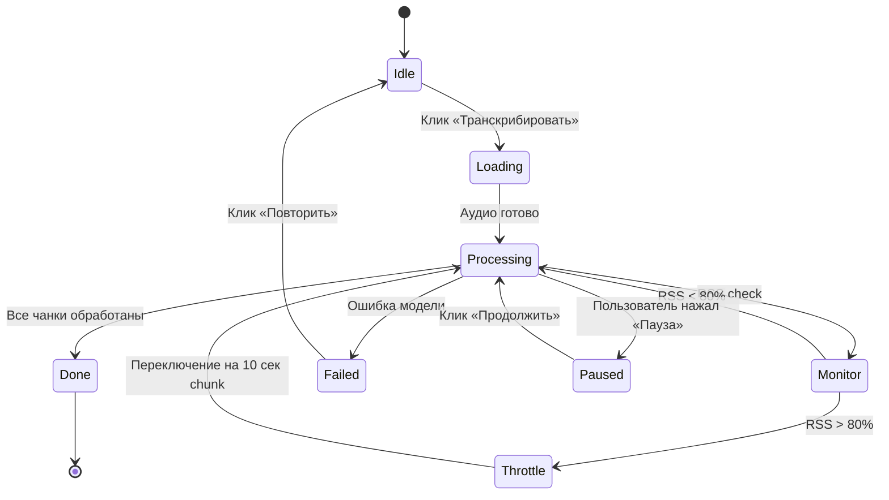

### 6.2. ST-02: Live Mode (встреча)

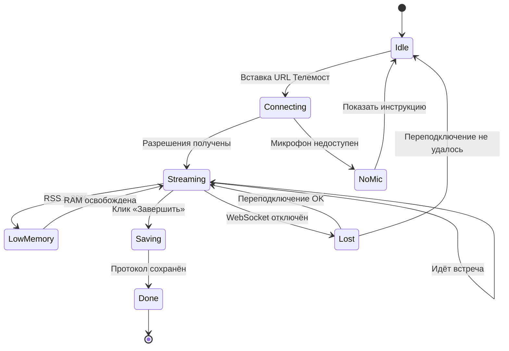

### 6.3. ST-03: Экспорт DOCX

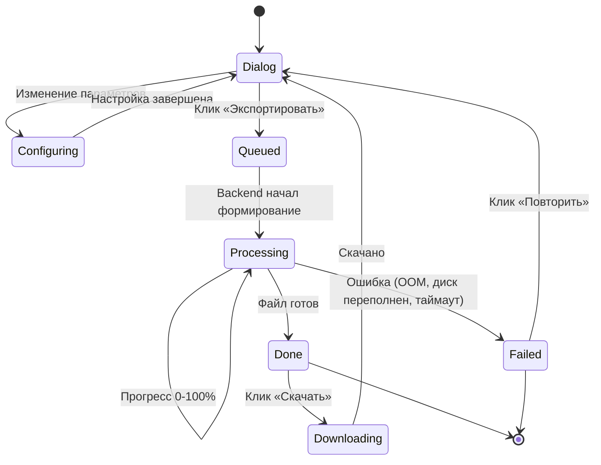

### 6.4. ST-04: Поиск

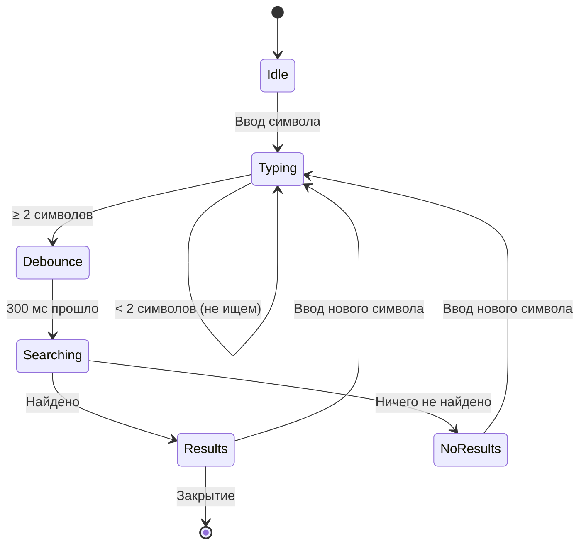

---

## 7. User Journey Map

### 7.1. P-01 Алексей (Windows, основная)

**Цель:** Получить DOCX встречи за ≤15 минут после загрузки.

| Этап | Действия | Мысли | Эмоции | Боли |
|---|---|---|---|---|
| 1. Старт | Открывает приложение | «Что там нового?» | 😐 Нейтрально | Ничего |
| 2. Загрузка | Drag-n-drop файл | «Надеюсь, не упадёт» | 😐 | Файл большой |
| 3. Транскрипция | Ждёт 5 мин | «Работает, не трогаю» | 😌 Спокойно | Ничего |
| 4. Просмотр | Смотрит реплики | «О, всё на месте» | 😊 Радость | Не путает ораторов |
| 5. Правка | Исправляет 2 оратора | «Удобно» | 😌 | — |
| 6. Экспорт | Клик DOCX | «Скорее бы» | ⏳ | Долго ждать |
| 7. Готово | Скачивает файл | «Отлично!» | 🎉 | — |

**Wow-момент:** Автоматическое определение ораторов.

### 7.2. P-02 Алексей (Astra Linux, офлайн)

**Цель:** Найти детали прошлой встречи с заказчиком без интернета.

| Этап | Действия | Мысли | Эмоции | Боли |
|---|---|---|---|---|
| 1. Старт | Открывает приложение офлайн | «Откроется ли?» | 😟 Тревога | Без сети |
| 2. Календарь | Клик по дате | «О, открылся!» | 😊 | — |
| 3. Протокол | Клик по встрече | «Текст есть» | 😌 | Видео долго |
| 4. Поиск | Ищет «срок» | «Быстро нашёл!» | 😊 | — |
| 5. Клик по реплике | Видео с 14:23 | «О, точно!» | 🎉 | — |

**Wow-момент:** Полная функциональность офлайн.

### 7.3. P-03 Гость (на встрече)

**Цель:** Убедиться, что данные не уйдут в чужие облака.

| Этап | Действия | Мысли | Эмоции | Боли |
|---|---|---|---|---|
| 1. До встречи | Видит индикатор «ЗАПИСЬ ИДЁТ» | «Стоп, что это?» | 😟 | Смущение |
| 2. Видит PrivacyBadge | «Данные хранятся локально» | «Ок, не облако» | 😐 → 😌 | — |
| 3. Во время встречи | Забывает про запись | | 😐 Нейтрально | — |
| 4. После встречи | Получает DOCX | «Нормально написано» | 😊 | Может быть неточно |
| 5. Через полгода | Спрашивает копию | «Дайте протокол Х» | 😐 | Если не сохранили |

**Wow-момент:** Прозрачность «куда уходят данные».

---

## 8. Dead-ends и рекомендации

### Найденные потенциальные проблемы

| Экран | Проблема | Рекомендация |
|---|---|---|
| **S-007 SpeakerEditor** | Закрытие без сохранения — потеря правок | Подтверждение «Есть несохранённые правки. Закрыть?» |
| **S-009 ExportDialog** | Долгое формирование — пользователь закрывает вкладку | Предупреждение «Формирование идёт. Не закрывайте вкладку.» + WebSocket-уведомление о завершении |
| **S-010 LiveMode** | Зависание при потере WebSocket | Автопереподключение каждые 5 сек + явный индикатор «Переподключение…» |
| **S-011 SummaryButton** | LLM даёт плохой результат | Кнопка «Перегенерировать саммари» + редактирование |
| **S-016 PrivacyBadge** | Не виден гостю, если он не открывал приложение | Добавить в форму приглашения по email |
| **S-005 CalendarView** | Пусто при первом запуске | При первом открытии — экран приветствия с подсказкой «Загрузите первый файл» |

### Циклы в навигации

✅ **Циклов не обнаружено.** Все экраны либо ведут «дальше» (к действию), либо имеют явный выход (кнопка «Назад» или закрытие модалки).

### Рекомендации по улучшению

1. **S-001 Home** — добавить кнопку «Справка» с quick start tutorial.
2. **S-003 UploadForm** — добавить Drag & Drop для файлов (расширение, не в MVP).
3. **S-004 ProtocolView** — добавить кнопку «Следующий протокол» для быстрого перехода.
4. **S-010 LiveMode** — сохранять последний URL Телемоста для быстрого подключения.
5. **S-014 SearchBar** — добавить hot key Ctrl+K для фокуса.

---

## 9. Связь с другими артефактами

- **US_LIST.md:** 36 US → 16 экранов + 8 sequence + 4 state-диаграмм.
- **Формы:** S-003, S-004, S-005, S-006, S-009, S-010 — это 6 спецификаций из `artifacts/05-forms/`.
- **Процессы:** P-01..P-04 → основные сценарии (SC-01..SC-08).
- **Персоны:** P-01, P-02, P-03 → journey maps в §7.

---

## 10. Следующие шаги

1. ✅ `screen-flow-designer` — этот документ (`SCREEN_FLOW.md`).
2. ➡️ `data-model-designer` — модель данных на основе16 экранов и 6 форм.
3. ➡️ `api-detail-designer` — спецификация API (FastAPI эндпоинты).
4. ➡️ `nfr-spec-builder` — нефункциональные требования.
5. ➡️ `traceability-matrix` — матрица связей US ↔ формы ↔ API ↔ БД ↔ NFR.

## UX-полировка (E133-E144)

### Compact card layout

```
┌──────────────────────────────────────────────────────────────┐
│ [Speaker 1] 00:15:32 ███████░░░░░  [✨ AI] [👥 Diar]            │
│ Текст реплики в одну строку для быстрого чтения               │
├──────────────────────────────────────────────────────────────┤
│ [Speaker 2] 00:18:05 ██████░░░░░░░░░░░                  │
│ Другая реплика с badge Speaker 2 другого цвета                │
└──────────────────────────────────────────────────────────────┘
```

Высота: ~30px на реплику → 30 реплик помещаются без скролла.
