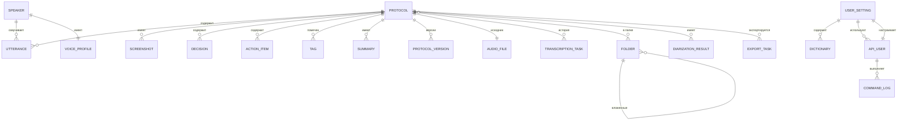

# Data Model: HTML_MeetingProtokol

## 1. Метаинформация

| Поле | Значение |
|---|---|
| **Проект** | HTML_MeetingProtokol |
| **Дата** | 2026-09-21 |
| **Источники** | US_LIST.md (66 US, 15 эпиков), формы (F-HMP-1..6), процессы (P-01..P-04) |
| **Тип БД** | PostgreSQL 15 |
| **ORM** | SQLAlchemy 2.x + Alembic (миграции) |
| **Хранение данных** | Локальное (SQLite для offline, PostgreSQL для синхронизации) |
| **Автор** | Алексей |
| **Версия** | 1.1 |

## 2. ER-диаграмма



**Сущности:** 19 таблиц
**FK-связи:** 28+

## 3. Сущности (словарь)

| # | Сущность | Назначение | Источник |
|---|---|---|---|
| 3.1 | `user_setting` | Настройки пользователя (single-user, все поля UI) | US-026, US-054..066 |
| 3.2 | `audio_file` | Метаданные исходного аудио/видео файла | US-001, 002, 063 |
| 3.3 | `folder` | Папка для группировки протоколов (древовидная структура) | US-059, 060, 061 |
| 3.4 | `protocol` | Основная запись протокола встречи | US-001, 005, 010 |
| 3.5 | `voice_profile` | Голосовой отпечаток оратора для автодиаризации | US-007 |
| 3.6 | `speaker` | Оратор на встрече (с реальным именем) | US-007, 008 |
| 3.7 | `utterance` | Реплика с таймкодом, оратором и текстом | US-005, 006, 007 |
| 3.8 | `screenshot` | Скриншот экрана демонстранта | US-016, 021 |
| 3.9 | `decision` | Принятое решение | US-022, 023 |
| 3.10 | `action_item` | Задача (кто/что/когда) | US-023 |
| 3.11 | `tag` | Тег протокола (тема/проект) | US-025, 042 |
| 3.12 | `summary` | Саммари встречи (LLM-сгенерированное) | US-022, 037 |
| 3.13 | `protocol_version` | История изменений протокола | US-048 |
| 3.14 | `diarization_result` | Результат автодиаризации (с оценкой качества) | US-007 |
| 3.15 | `transcription_task` | Активная задача транскрипции (с прогрессом) | US-005, 055 |
| 3.16 | `dictionary` | Пользовательский словарь терминов | US-047 |
| 3.17 | `api_user` | Пользователь Telegram-бота (P-01) | US-037, 041 |
| 3.18 | `command_log` | Лог команд Telegram-бота | US-039, 041 |
| 3.19 | `export_task` | Задача экспорта DOCX (асинхронная) | US-015, 016, 017 |

## 4. Таблицы (детальное описание)

### 4.1. `user_setting` (расширенная для US-054..066)

**Назначение:** Настройки приложения (single-user pattern).

**Колонки (20):**

| Колонка | Тип | NULL | Default | Описание |
|---|---|---|---|---|
| `id` | UUID | NO | `gen_random_uuid()` | PK |
| `llm_provider` | ENUM(llm_provider) | NO | `'hermes'` | Основной LLM |
| `llm_model` | VARCHAR(100) | YES | | Модель LLM |
| `whisper_model` | ENUM(whisper_model) | NO | `'large-v3'` | Размер Whisper |
| `whisper_prompt` | TEXT | YES | | Промпт для Whisper |
| `theme` | ENUM(theme) | NO | `'auto'` | Тема UI |
| `hotkey_show_search` | VARCHAR(50) | NO | `'Ctrl+K'` | Hotkey для поиска |
| `notifications_enabled` | BOOLEAN | NO | `true` | Уведомления |
| `user_name` | VARCHAR(100) | YES | | Имя пользователя (US-054) |
| `email` | VARCHAR(255) | YES | | Email (US-054) |
| `timezone` | VARCHAR(50) | YES | `'Europe/Moscow'` | Часовой пояс |
| `default_language` | VARCHAR(20) | YES | `'ru'` | Язык по умолчанию (US-055) |
| `use_gpu` | BOOLEAN | YES | `false` | Использовать GPU (US-055) |
| `default_provider` | VARCHAR(50) | YES | | AI provider (US-066, aliases llm_provider) |
| `fallback_provider` | VARCHAR(50) | YES | | Резервный AI provider |
| `api_keys` | TEXT | YES | | "HERMES_API_KEY=...\nGIGACHAT_API_KEY=..." |
| `telegram_bot_token` | TEXT | YES | | Telegram bot token (US-057) |
| `telegram_webhook_url` | TEXT | YES | | Telegram webhook |
| `telegram_allowed_users` | TEXT | YES | | Whitelist ID через запятую |
| `updated_at` | TIMESTAMP | NO | `NOW()` | Последнее обновление |

### 4.2. `audio_file` (US-063 — добавлено file_path)

| Колонка | Тип | NULL | Default | Описание |
|---|---|---|---|---|
| `id` | UUID | NO | `gen_random_uuid()` | PK |
| `protocol_id` | UUID | YES | | FK → protocol.id |
| `filename` | VARCHAR(255) | NO | | Имя файла |
| `file_path` | TEXT | YES | | **Полный путь к файлу на диске (US-063)** |
| `extension` | VARCHAR(20) | NO | | Расширение (.mp4, .wav) |
| `size_bytes` | BIGINT | NO | | Размер в байтах |
| `mime_type` | VARCHAR(50) | YES | | MIME тип |
| `checksum_sha256` | VARCHAR(64) | YES | | SHA-256 хэш |
| `duration_sec` | INTEGER | YES | | Длительность |
| `sample_rate` | INTEGER | YES | | Sample rate |
| `source` | VARCHAR(20) | NO | `'local'` | local/url/upload |
| `source_url` | TEXT | YES | | URL оригинала |
| `created_at` | TIMESTAMP | NO | `NOW()` | Дата загрузки |

### 4.3. `folder` (EPIC-FOLDERS, US-059..062)

| Колонка | Тип | NULL | Default | Описание |
|---|---|---|---|---|
| `id` | UUID | NO | `gen_random_uuid()` | PK |
| `name` | VARCHAR(255) | NO | | Название папки |
| `color` | VARCHAR(20) | YES | `'#3b82f6'` | Цвет иконки |
| `icon` | VARCHAR(50) | YES | `'folder'` | Иконка (Material Icon name) |
| `parent_id` | UUID | YES | | FK → folder.id (вложенные папки), CASCADE |
| `user_id` | UUID | YES | | Для будущего multi-user |
| `sort_order` | INTEGER | YES | `0` | Порядок сортировки |
| `created_at` | TIMESTAMP | NO | `NOW()` | Дата создания |
| `updated_at` | TIMESTAMP | NO | `NOW()` | Дата изменения |

**Связи:**
- `parent_id` → `folder.id` (самоссылка, CASCADE)
- Протоколы не удаляются при удалении папки (только `folder_id = NULL` в protocol)

### 4.4. `protocol` (US-053, 060 — добавлено folder_id)

| Колонка | Тип | NULL | Default | Описание |
|---|---|---|---|---|
| `id` | UUID | NO | `gen_random_uuid()` | PK |
| `title` | VARCHAR(255) | NO | | Название встречи |
| `date` | DATE | NO | | Дата встречи |
| `location` | VARCHAR(255) | YES | | Место / платформа |
| `chair` | VARCHAR(100) | YES | | Председатель |
| `agenda` | TEXT | YES | | Повестка |
| `decisions_summary` | TEXT | YES | | Резюме решений |
| `duration_sec` | INTEGER | YES | | Длительность |
| `wer_quality` | NUMERIC(5,2) | YES | | WER % |
| `status` | ENUM(protocol_status) | NO | `'loaded'` | Статус |
| `folder_id` | UUID | YES | | **FK → folder.id, SET NULL (US-053, 060)** |
| `audio_file_id` | UUID | YES | | FK → audio_file.id, SET NULL |
| `created_at` | TIMESTAMP | NO | `NOW()` | |
| `updated_at` | TIMESTAMP | NO | `NOW()` | |
| `deleted_at` | TIMESTAMP | YES | | Soft delete (US-052) |

### 4.5. `voice_profile`
| `id` | UUID | NO | `gen_random_uuid()` | PK |
| `display_name` | VARCHAR(100) | NO | | Имя оратора |
| `embedding_vector` | BYTEA | YES | | Эмбеддинг голоса |
| `sample_count` | INTEGER | YES | `0` | Сколько раз опознан |
| `last_used_at` | TIMESTAMP | YES | | Последний раз |
| `created_at` | TIMESTAMP | NO | `NOW()` | |

### 4.6. `speaker`

| Колонка | Тип | NULL | Default | Описание |
|---|---|---|---|---|
| `id` | UUID | NO | `gen_random_uuid()` | PK |
| `protocol_id` | UUID | NO | | FK → protocol.id |
| `speaker_label` | VARCHAR(20) | NO | | Метка (SPEAKER_01) |
| `display_name` | VARCHAR(100) | YES | | Имя (если назначено) |
| `color` | VARCHAR(20) | YES | | Цвет в UI |
| `voice_profile_id` | UUID | YES | | FK → voice_profile.id |
| `is_user` | BOOLEAN | NO | `false` | Это пользователь? |
| `created_at` | TIMESTAMP | NO | `NOW()` | |

### 4.7. `utterance`

| Колонка | Тип | NULL | Default | Описание |
|---|---|---|---|---|
| `id` | UUID | NO | `gen_random_uuid()` | PK |
| `protocol_id` | UUID | NO | | FK → protocol.id |
| `speaker_id` | UUID | YES | | FK → speaker.id |
| `start_sec` | DECIMAL(10,3) | NO | | Начало (сек) |
| `end_sec` | DECIMAL(10,3) | NO | | Конец (сек) |
| `text` | TEXT | NO | | Распознанный текст |
| `text_original` | TEXT | YES | | Оригинал (до правок) |
| `confidence` | DECIMAL(5,4) | YES | | Уверенность (0-1) |
| `low_confidence` | BOOLEAN | NO | `false` | Помечен как `[?]` |
| `important` | BOOLEAN | NO | `false` | Пометка важное |
| `corrected_by_llm` | BOOLEAN | NO | `false` | LLM-коррекция применена |
| `action_item_id` | UUID | YES | | Связь с action_item |
| `created_at` | TIMESTAMP | NO | `NOW()` | |
| `updated_at` | TIMESTAMP | NO | `NOW()` | |

### 4.8. `screenshot`

| Колонка | Тип | NULL | Default | Описание |
|---|---|---|---|---|
| `id` | UUID | NO | `gen_random_uuid()` | PK |
| `protocol_id` | UUID | NO | | FK → protocol.id |
| `file_path` | TEXT | NO | | Путь к PNG-файлу |
| `timestamp_sec` | DECIMAL(10,3) | NO | | Время в видео |
| `width_px` | INTEGER | YES | | Ширина |
| `height_px` | INTEGER | YES | | Высота |
| `file_size_kb` | INTEGER | YES | | Размер файла |
| `caption` | TEXT | YES | | Подпись/описание |
| `created_at` | TIMESTAMP | NO | `NOW()` | |

### 4.9. `decision`

| Колонка | Тип | NULL | Default | Описание |
|---|---|---|---|---|
| `id` | UUID | NO | `gen_random_uuid()` | PK |
| `protocol_id` | UUID | NO | | FK → protocol.id |
| `text` | TEXT | NO | | Текст решения |
| `decided_by` | VARCHAR(100) | YES | | Кто решил |
| `source_utterance_id` | UUID | YES | | FK → utterance.id (основа) |
| `priority` | VARCHAR(20) | YES | | low/medium/high |
| `created_at` | TIMESTAMP | NO | `NOW()` | |

### 4.10. `action_item`

| Колонка | Тип | NULL | Default | Описание |
|---|---|---|---|---|
| `id` | UUID | NO | `gen_random_uuid()` | PK |
| `protocol_id` | UUID | NO | | FK → protocol.id |
| `owner` | VARCHAR(100) | YES | | Ответственный |
| `task` | TEXT | NO | | Задача |
| `deadline` | TIMESTAMP | YES | | Дедлайн |
| `status` | VARCHAR(20) | NO | `'open'` | open/done/cancelled |
| `source_utterance_id` | UUID | YES | | FK → utterance.id |
| `source` | VARCHAR(20) | YES | | manual/ai/extracted |
| `confidence` | DECIMAL(5,4) | YES | | Уверенность AI |
| `completed_at` | TIMESTAMP | YES | | Когда сделано |
| `created_at` | TIMESTAMP | NO | `NOW()` | |

### 4.11. `tag`

| Колонка | Тип | NULL | Default | Описание |
|---|---|---|---|---|
| `id` | UUID | NO | `gen_random_uuid()` | PK |
| `protocol_id` | UUID | NO | | FK → protocol.id |
| `name` | VARCHAR(50) | NO | | Название тега |
| `source` | VARCHAR(20) | YES | | manual/ai |
| `color` | VARCHAR(20) | YES | | Цвет |
| `created_at` | TIMESTAMP | NO | `NOW()` | |

### 4.12. `summary`

| Колонка | Тип | NULL | Default | Описание |
|---|---|---|---|---|
| `id` | UUID | NO | `gen_random_uuid()` | PK |
| `protocol_id` | UUID | NO | | FK → protocol.id |
| `text` | TEXT | NO | | Саммари |
| `provider` | VARCHAR(20) | YES | | LLM провайдер (hermes/gigachat) |
| `model` | VARCHAR(100) | YES | | Использованная модель |
| `generated_at` | TIMESTAMP | NO | `NOW()` | Время генерации |
| `tokens_used` | INTEGER | YES | | Потрачено токенов |
| `regenerated` | BOOLEAN | NO | `false` | Был ли регенерирован |

### 4.13. `protocol_version`

| Колонка | Тип | NULL | Default | Описание |
|---|---|---|---|---|
| `id` | UUID | NO | `gen_random_uuid()` | PK |
| `protocol_id` | UUID | NO | | FK → protocol.id |
| `version_number` | INTEGER | NO | | Номер версии |
| `snapshot` | JSONB | NO | | Снимок |
| `changed_field` | VARCHAR(100) | YES | | Что изменено |
| `changed_by` | VARCHAR(100) | YES | | Кто изменил |
| `change_reason` | TEXT | YES | | Причина |
| `created_at` | TIMESTAMP | NO | `NOW()` | |

### 4.14. `diarization_result`

| Колонка | Тип | NULL | Default | Описание |
|---|---|---|---|---|
| `id` | UUID | NO | `gen_random_uuid()` | PK |
| `protocol_id` | UUID | NO | | FK → protocol.id |
| `der_score` | DECIMAL(5,4) | YES | | Diarization Error Rate |
| `num_speakers_detected` | INTEGER | YES | | Найдено ораторов |
| `num_speakers_expected` | INTEGER | YES | | Ожидалось |
| `pipeline_version` | VARCHAR(50) | YES | | Версия пайплайна |
| `confidence_avg` | DECIMAL(5,4) | YES | | Средняя уверенность |
| `segments_json` | JSONB | YES | | Сегменты |
| `created_at` | TIMESTAMP | NO | `NOW()` | |

### 4.15. `transcription_task` (US-005, 055)

| Колонка | Тип | NULL | Default | Описание |
|---|---|---|---|---|
| `id` | UUID | NO | `gen_random_uuid()` | PK |
| `protocol_id` | UUID | NO | | FK → protocol.id, CASCADE |
| `status` | VARCHAR(20) | NO | `'queued'` | queued/running/done/failed/cancelled |
| `progress` | DECIMAL(5,2) | NO | `0.0` | 0-100% |
| `current_step` | VARCHAR(100) | YES | | Текущий этап |
| `error_message` | TEXT | YES | | Сообщение об ошибке |
| `started_at` | TIMESTAMP | NO | `NOW()` | Начало |
| `updated_at` | TIMESTAMP | NO | `NOW()` | Последнее обновление |
| `finished_at` | TIMESTAMP | YES | | Завершение |

**Индексы:** `idx_task_protocol`, `idx_task_status`

### 4.16. `dictionary`

| Колонка | Тип | NULL | Default | Описание |
|---|---|---|---|---|
| `id` | UUID | NO | `gen_random_uuid()` | PK |
| `user_setting_id` | UUID | NO | | FK → user_setting.id |
| `term` | VARCHAR(255) | NO | | Термин |
| `category` | VARCHAR(50) | YES | | Категория |
| `weight` | INTEGER | NO | `1` | Вес при OCR |
| `created_at` | TIMESTAMP | NO | `NOW()` | |

### 4.17. `api_user`

| Колонка | Тип | NULL | Default | Описание |
|---|---|---|---|---|
| `id` | UUID | NO | `gen_random_uuid()` | PK |
| `telegram_id` | BIGINT | NO | | Telegram ID |
| `username` | VARCHAR(100) | YES | | @username |
| `display_name` | VARCHAR(100) | YES | | Имя |
| `is_active` | BOOLEAN | NO | `true` | Активен? |
| `user_setting_id` | UUID | YES | | FK → user_setting.id |
| `last_active_at` | TIMESTAMP | YES | | Последняя активность |
| `created_at` | TIMESTAMP | NO | `NOW()` | |

### 4.18. `command_log`

| Колонка | Тип | NULL | Default | Описание |
|---|---|---|---|---|
| `id` | UUID | NO | `gen_random_uuid()` | PK |
| `api_user_id` | UUID | NO | | FK → api_user.id |
| `command` | VARCHAR(100) | NO | | Команда (e.g. /help) |
| `args` | JSONB | YES | | Аргументы |
| `status` | VARCHAR(20) | NO | | success/error/pending |
| `error_message` | TEXT | YES | | Ошибка |
| `execution_ms` | INTEGER | YES | | Время выполнения |
| `tokens_used` | INTEGER | YES | | Потрачено LLM |
| `created_at` | TIMESTAMP | NO | `NOW()` | |

### 4.19. `export_task`

| Колонка | Тип | NULL | Default | Описание |
|---|---|---|---|---|
| `id` | UUID | NO | `gen_random_uuid()` | PK |
| `protocol_id` | UUID | NO | | FK → protocol.id |
| `format` | VARCHAR(10) | NO | `'docx'` | Формат |
| `include_timestamps` | BOOLEAN | NO | `true` | |
| `include_screenshots` | BOOLEAN | NO | `true` | |
| `include_video_links` | BOOLEAN | NO | `true` | |
| `group_by_speaker` | BOOLEAN | NO | `false` | |
| `mark_doubtful` | BOOLEAN | NO | `true` | |
| `status` | VARCHAR(20) | NO | `'queued'` | queued/running/done/failed |
| `progress_percent` | INTEGER | NO | `0` | |
| `output_path` | TEXT | YES | | Путь к .docx |
| `file_size_bytes` | BIGINT | YES | | Размер |
| `error_message` | TEXT | YES | | |
| `started_at` | TIMESTAMP | YES | | |
| `completed_at` | TIMESTAMP | YES | | |
| `created_at` | TIMESTAMP | NO | `NOW()` | |


### 4.20. `bot_connection_test` (US-067)

**Назначение:** Лог проверок связи с Telegram ботом.

**Колонки:**

| Колонка | Тип | NULL | Default | Описание |
|---|---|---|---|---|
| `id` | UUID | NO | `gen_random_uuid()` | PK |
| `bot_token_hash` | VARCHAR(64) | NO | | SHA256 хэш токена (не сам токен!) |
| `bot_username` | VARCHAR(100) | YES | | @username (если успех) |
| `bot_id` | BIGINT | YES | | Telegram ID бота |
| `result` | VARCHAR(20) | NO | | success/error/timeout |
| `error_message` | TEXT | YES | | Текст ошибки (если не успех) |
| `latency_ms` | INTEGER | NO | | Время запроса |
| `tested_at` | TIMESTAMP | NO | `NOW()` | Когда проверяли |

**Индексы:**
- `idx_bot_test_token (bot_token_hash)` — найти последнюю проверку для бота
- `idx_bot_test_date (tested_at)`

**Примеры SQL:**
```sql
-- Запросить последнюю проверку
SELECT * FROM bot_connection_test
WHERE bot_token_hash = 'hash-of-token'
ORDER BY tested_at DESC
LIMIT 1;
```


## 5. FK-связи (полный список)

| Откуда | → Куда | ON DELETE |
|---|---|---|
| `protocol.folder_id` | `folder.id` | SET NULL |
| `protocol.audio_file_id` | `audio_file.id` | SET NULL |
| `audio_file.protocol_id` | `protocol.id` | SET NULL |
| `speaker.protocol_id` | `protocol.id` | CASCADE |
| `speaker.voice_profile_id` | `voice_profile.id` | SET NULL |
| `utterance.protocol_id` | `protocol.id` | CASCADE |
| `utterance.speaker_id` | `speaker.id` | SET NULL |
| `utterance.action_item_id` | `action_item.id` | SET NULL |
| `screenshot.protocol_id` | `protocol.id` | CASCADE |
| `decision.protocol_id` | `protocol.id` | CASCADE |
| `decision.source_utterance_id` | `utterance.id` | SET NULL |
| `action_item.protocol_id` | `protocol.id` | CASCADE |
| `action_item.source_utterance_id` | `utterance.id` | SET NULL |
| `tag.protocol_id` | `protocol.id` | CASCADE |
| `summary.protocol_id` | `protocol.id` | CASCADE |
| `protocol_version.protocol_id` | `protocol.id` | CASCADE |
| `diarization_result.protocol_id` | `protocol.id` | CASCADE |
| `transcription_task.protocol_id` | `protocol.id` | CASCADE |
| `folder.parent_id` | `folder.id` | CASCADE |
| `dictionary.user_setting_id` | `user_setting.id` | CASCADE |
| `api_user.user_setting_id` | `user_setting.id` | SET NULL |
| `command_log.api_user_id` | `api_user.id` | CASCADE |
| `export_task.protocol_id` | `protocol.id` | CASCADE |

## 6. Индексы (полный список)

| Таблица | Индекс | Тип |
|---|---|---|
| `protocol` | `idx_protocol_date` | btree (date) |
| `protocol` | `idx_protocol_status` | btree (status) |
| `protocol` | `idx_protocol_created_at` | btree (created_at) |
| `protocol` | `idx_protocol_folder` | btree (folder_id) |
| `folder` | `idx_folder_user` | btree (user_id) |
| `folder` | `idx_folder_parent` | btree (parent_id) |
| `folder` | `idx_folder_sort` | btree (sort_order) |
| `transcription_task` | `idx_task_protocol` | btree (protocol_id) |
| `transcription_task` | `idx_task_status` | btree (status) |
| `utterance` | `idx_utterance_protocol` | btree (protocol_id) |
| `speaker` | `idx_speaker_protocol` | btree (protocol_id) |

## 7. Изменения в версии 1.1 (2026-09-21)

| Изменение | Источник |
|---|---|
| ➕ Добавлена таблица `folder` | US-059..062 |
| ➕ Добавлена таблица `transcription_task` | US-005, 055 |
| ➕ Колонка `protocol.folder_id` | US-053, 060 |
| ➕ Колонка `audio_file.file_path` | US-063 |
| ➕ Колонки `user_setting` расширены (11 полей) | US-054..066 |
| 🔧 Уточнены FK-отношения | US-059, 060 |

## 8. Связь с другими артефактами

- **US:** каждая таблица привязана к US (см. §3 столбец "Источник")
- **API:** каждый эндпоинт работает с таблицами из DATA_MODEL.md
- **NFR:** §5.1 Производительность (latency запросов)
- **Vision:** §7.1 Базовое ядро — "Локальная работа с данными"

### 10. Whisper Model Cache (US-058, US-075)

Модели Whisper хранятся в локальном HF-кэше, **не в БД**.

```sql
-- Нет таблиц для моделей, используется файловая система
-- Cache location: $HF_HUB_CACHE или ~/.cache/huggingface/hub
```

Структура на диске:
```
~/.cache/huggingface/hub/
└── models--Systran--faster-whisper-large-v3/
    ├── blobs/
    │   ├── model.bin
    │   ├── tokenizer.json
    │   └── config.json
    └── snapshots/
        └── {commit_hash}/
            ├── config.json -> ../blobs/{hash}
            └── model.bin -> ../blobs/{hash}
```

Зависимости:
- `user_setting.whisper_model` — какая модель активна
- `user_setting.use_gpu` — использовать GPU (влияет на compute_type)
- `user_setting.default_language` — язык по умолчанию (например ru)

## Streaming insertion pattern (E131)

В таблице `utterance` теперь два пути вставки:

1. **Потоковый (рекомендуется для production):**
   - `transcription_service._persist_utterances_loop` пишет каждые 2 сек из очереди
   - Сегменты становятся видны в UI в течение ~2 сек после их распознавания моделью

2. **Batch (legacy/fallback):**
   - `transcription_service._save_utterances` пишет одной транзакцией в конце
   - Подходит для тестов / коротких записей (< 30 сек)
